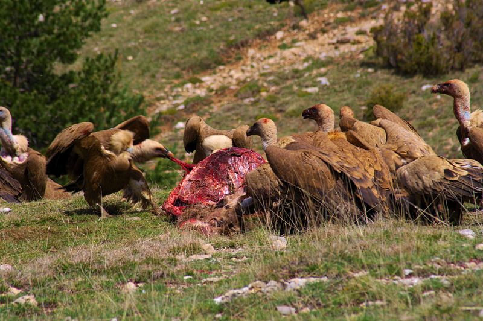

<div id="top"></div>

<br />

[](https://github.com/palmaraz/SaniVult/blob/master/LICENSE)

<br />

# The SaniVult project

<br />

<!-- TABLE OF CONTENTS -->

<details>
  <summary>Table of Contents</summary>
  <ol>
    <li>
      <a href="#about">About</a>
      <ul>
        <li><a href="#abstract">Abstract</a></li>
      </ul>
      <ul>
        <li><a href="#built-with">Built With</a></li>
      </ul>
    </li>
    <li>
      <a href="#reproducible-workflow">Reproducible workflow</a>
      <ul>
        <li><a href="#prerequisites">Prerequisites</a></li>
        <li><a href="#workflow">Workflow</a></li>
      </ul>
    </li>
    <li><a href="#usage">Usage</a></li>
    <li><a href="#roadmap">Roadmap</a></li>
    <li><a href="#license">License</a></li>
    <li><a href="#contact">Contact</a></li>
    <li><a href="#folder-structure">Folder structure</a></li>
  </ol>
</details>

<br />

<!-- ABOUT THE PROJECT -->

## About

This is the GitHub hosting of the project [SaniVult](https://github.com/palmaraz/SaniVult). The paper associated to the project is published in the journal [Ecological Applications](https://esajournals.onlinelibrary.wiley.com/journal/19395582). See the `CITATION`for a BibTex entry to the article. This folder contains the files needed to reproduce all the results of the project, and compile the manuscript of the associated paper.

The major goal of the project is to evaluate the impacts of the outbreak of a Bovine Spongiform Encephalopathy epidemic on the demographic and population dynamics of one of the world's largest colonies of the Eurasian Griffon vulture (*Gyps fulvus*). The Eurasian Griffon vulture is a keystone scavenger providing fundamental ecosystem services worldwide. For further details, see the **abstract** below and the file `ms/main_text.pdf`. Read the [published version of the paper](https://esajournals.onlinelibrary.wiley.com/journal/19395582).

<p align="right">(<a href="#top">back to top</a>)</p>

<br />

<!-- PROJECT LOGO -->
<p align="center">
  <a href="https://github.com/palmaraz/SaniVult">
    
  </a>
</p>


### Abstract

Scavenging is a key ecological process controlling energy flow in ecosystems and providing valuable ecosystem services worldwide. As long-lived species, the demographic dynamics of vultures can be disrupted by spatio-temporal fluctuations in food availability, with dramatic impacts on their population viability and the ecosystem services provided. In Europe, the outbreak of Bovine Spongiform Encephalopathy (BSE) in 2001 prompted a restrictive sanitary legislation banning the presence of livestock carcasses in the wild at a continental scale. In long-lived vertebrate species the buffering hypothesis predicts that the demographic traits with the largest contribution to population growth rate should be less temporally variable. The BSE outbreak provides a unique opportunity to test for the impact of demographic buffering in a keystone scavenger suffering abrupt but transient food shortages. We study the 42-year dynamics (1978-2020) of one of the world’s largest breeding colonies of Eurasian griffon vultures (*Gyps fulvus*). We fitted an inverse Bayesian state-space model with density-dependent demographic rates to the time-series of stage-structured abundances to investigate shifts in vital rates and population dynamics before, during and after the implementation of a restrictive sanitary regulation. Prior to the BSE outbreak the dynamics was mainly driven by adult survival: 83% of temporal variance in abundance was explained by variability in this rate. Moreover, during this period the regulation of population size operated through density-dependent fecundity and sub-adult survival. However, after the onset of the European ban, a one-month delay in average laying date, a drop in fecundity and a reduction in the number of fledglings induced a transient increase in the impact of fledgling and sub-adult recruitment on dynamics. Although adult survival rate remained constantly high, as predicted by the buffering hypothesis, its relative impact on the temporal variance in abundance dropped to 71% during the sanitary legislation and to 54% after the ban was lifted. A significant increase in the relative impact of environmental stochasticity on dynamics was modeled after the BSE outbreak. These results provide empirical evidence on how abrupt environmental deterioration may induce dramatic demographic and dynamic changes in the populations of keystone scavengers, with far-reaching impacts on ecosystem functioning worldwide.

<p align="right">(<a href="#top">back to top</a>)</p>

### Built With

This is a [workflowr](https://github.com/jdblischak/workflowr) project bootstraped by a suite of open-source tools.

-   [GNU/Linux](https://www.gnu.org/)
-   [Ubuntu Budgie](https://ubuntubudgie.org/)
-   [GNU Make](https://www.gnu.org/software/make/)
-   [C++](https://isocpp.org/)
-   [gpp](https://logological.org/gpp)
-   [TexStudio](https://www.texstudio.org/)
-   [JAGS](https://sourceforge.net/projects/mcmc-jags/)
-   [R](https://cran.r-project.org/)
-   [RStudio](https://www.rstudio.com/)

A suite of [R](https://cran.r-project.org/) packages were used in this project. I am [grateful](https://github.com/Pakillo/grateful) to all the people involved in the development of these open-source packages:


```R
grateful::cite_packages(out.format = "rmd", out.dir = file.path(getwd(), "analysis"))
```

<p align="right">(<a href="#top">back to top</a>)</p>

<!-- GETTING STARTED -->

## Reproducible workflow

This section shows how to reproduce the results of the accompanying paper. The folder `./code` has the following structure:

```bash
.
├── ./code
│   ├── ./code/S4D3M_JAGS_Fitting.R
│   ├── ./code/S4D3M_JAGS_model.R
│   └── ./code/utilities.r

```

In this folder, the file `./code/utilities.r` contains all the functions and utilities necessary to conduct the analyses. The file `./code/S4D3M_JAGS_model.R` contains the state-space stage-structured demographic density-dependent model (S4D3M) developed in the [accompanying paper](https://esajournals.onlinelibrary.wiley.com/journal/19395582) written in the [JAGS](https://sourceforge.net/projects/mcmc-jags/) language.

The data folder has the following structure:

```bash
├── ./data
│   ├── ./data/Breeding_output.csv
│   ├── ./data/BSE_cases.csv
│   └── ./data/data.csv
```

See [below](#full-folder-structure) for a full folder structure

#### Prerequisites

Prior to reproducing the results, make sure to have installed all the necessary software. In particular, you need [JAGS](https://sourceforge.net/projects/mcmc-jags/) and [R](https://cran.r-project.org/). The [R](https://cran.r-project.org/) libraries needed to reproduce the results will be automatically installed by the package [pacman](https://github.com/trinker/pacman).

### Workflow

You can reproduce the results of the accompanying with two methods:

1.  From within `R`, simply `source` the file `./code/S4D3M_JAGS_Fitting.R`. This will perform all the analyses of the paper in the required order. Note that the S4D3M is fitted through Bayesian MCMC methods using Gibbs sampling, and runs in [JAGS](https://sourceforge.net/projects/mcmc-jags/): even though [JAGS](https://sourceforge.net/projects/mcmc-jags/) is written in the [C++](https://isocpp.org/) language, the code can take several hours to run depending on the architecture used. Note that there are relatively easy ways of parallelizing this code.

2.  The second, easiest way to reproduce all the analyese in the project is to use the `Makefile`. With simple [GNU Make](https://www.gnu.org/software/make/) syntax, you can reproduce all the project, from statistical analyses to manuscript production. For exampole, in [GNU/Linux](https://www.gnu.org/) based systems, you can point with the command shell to the project folder and run the following command:

    ``` sh
    make all
    ```

This command will perform the following:

1. It will conduct all the statistical analyses in the project, and produce all the figures.

2. It will assemble and compile the manuscript and associated supplementary materials with the necessary figures, and open the files.

<p align="right">(<a href="#top">back to top</a>)</p>

<!-- ROADMAP -->

## Roadmap

-   [ ] Add links to the final files and web addresses.

-   [x] Add back to top links


<p align="right">(<a href="#top">back to top</a>)</p>

<!-- LICENSE -->

## License

Distributed under the MIT License. See `LICENSE` for more information.

<p align="right">(<a href="#top">back to top</a>)</p>

<!-- CONTACT -->

## Contact

Pablo Almaraz - [\@palmaraz_Eco](https://twitter.com/palmaraz_Eco) - [palmaraz\@gmail.com](mailto:palmaraz@gmail.com)

Personal webpage: <https://palmaraz.github.io/>

Project Link: <https://github.com/palmaraz/SaniVult>

<p align="right">(<a href="#top">back to top</a>)</p>

- base [@base]
- workflowr [@workflowr]
- rmarkdown [@rmarkdown]
- checkpoint [@checkpoint]
- coda [@coda]
- data.table [@data.table]
- ggmcmc [@ggmcmc]
- ggsci [@ggsci]
- grateful [@grateful]
- mvtnorm [@mvtnorm]
- pacman [@pacman]
- patchwork [@patchwork]
- runjags [@runjags]
- tidyverse [@tidyverse]
- truncnorm [@truncnorm]
- viridis [@viridis]
- xtable [@xtable]
- dplyr [@dplyr]
- ggpubr [@ggpubr]
- plyr [@plyr]
- readr [@readr]
- reshape2 [@reshape2]
- tibble [@tibble]

